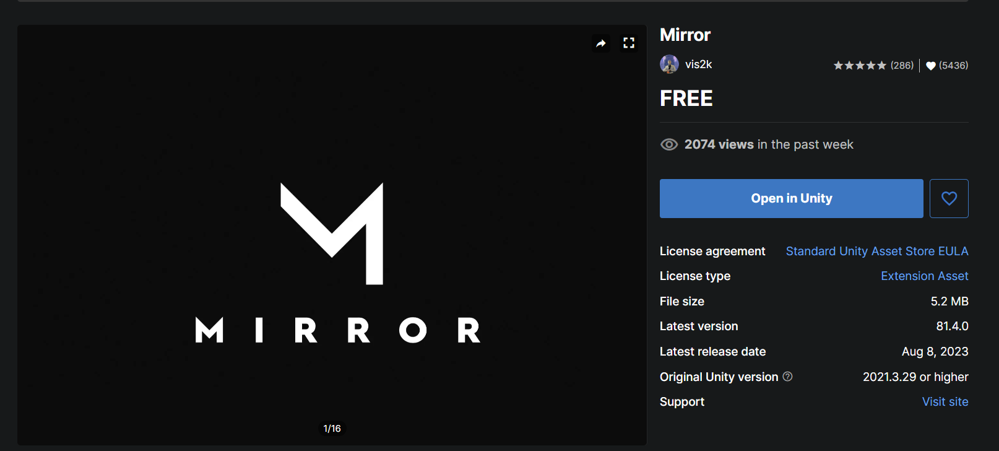

# READMI

## Install

1\) Import Mirror Networking in your project

2\) just install archive of this repo and move scripts in your Unity project!

## How to use

1. Set **ZoneInterestManagement** component on NetworkManager object
2. Create GameObject&#x20;
3. Add Rigidbody component on this object
4. Add collider component and set checkbox _isTrigger_
5. After, add **NetworkZone** or **NetworkZone2D** component on this object

## What this?

**Zone Interest Management** - this is a custom script inherited from InterestManagement!

The essence of this mechanism is that certain updates of the world are intended for certain areas of the same world.

Suppose we have a Dust2 card. On it, we will arrange Trigger colliders so that they display the visibility zones of our players. By entering a certain square, the player will in fact be able to see only what is happening in the square in which he is located.

<figure><figcaption>
Dust2 map from CS:GO
</figcaption></figure>

How could this help? At a minimum, I think it would reduce the requirements for gateway bandwidth. But the most important thing is protection from a cheat also referred to as "WallHack". If the attacker does not receive packets about updating the opponent's position behind the wall, then, accordingly, he will not be able to calculate it behind the wall.

### Let's now try it out with an example

Let's create a simple map and arrange the colliders in it so that the players can see each other without obstacles, but so that the obstacle prevents them from seeing each other

<figure><figcaption></figcaption></figure>

<figure><figcaption></figcaption></figure>

### Lets go test this!


